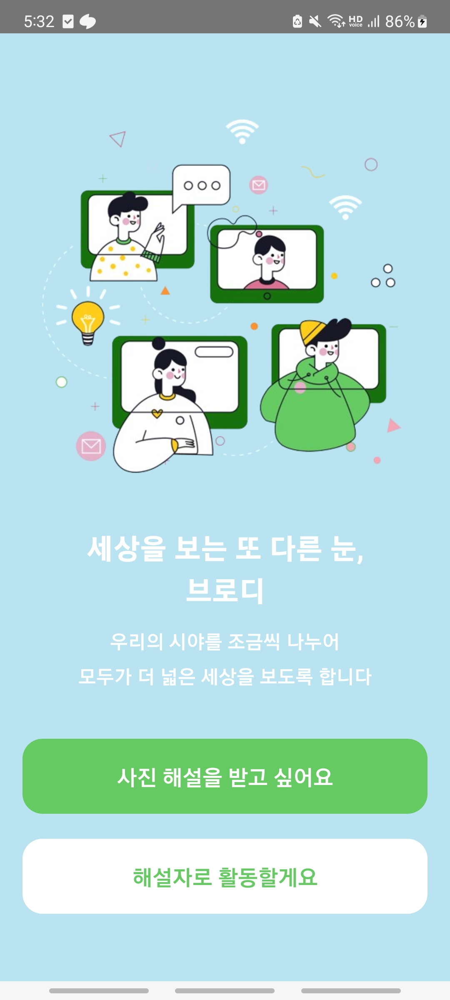
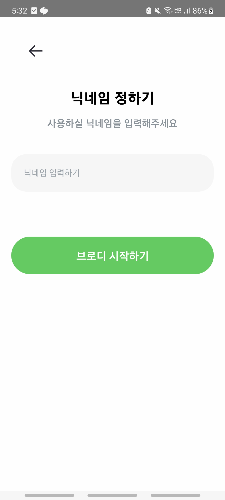
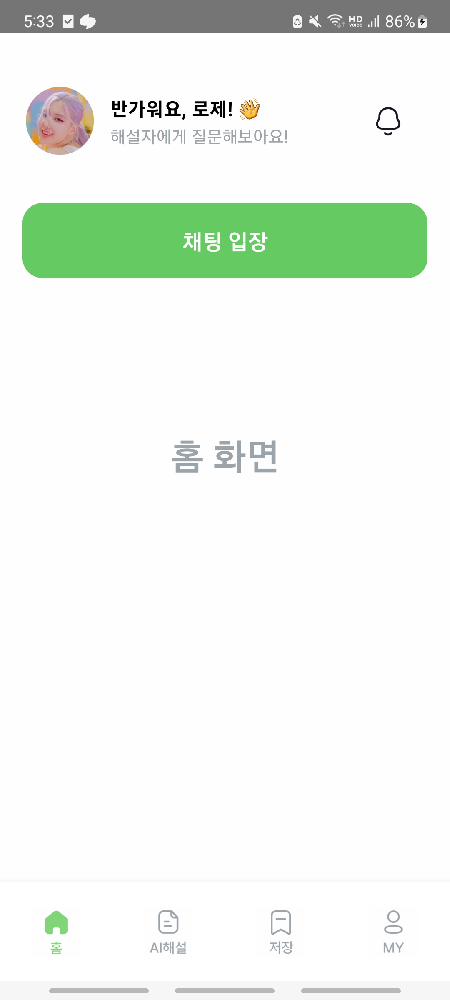
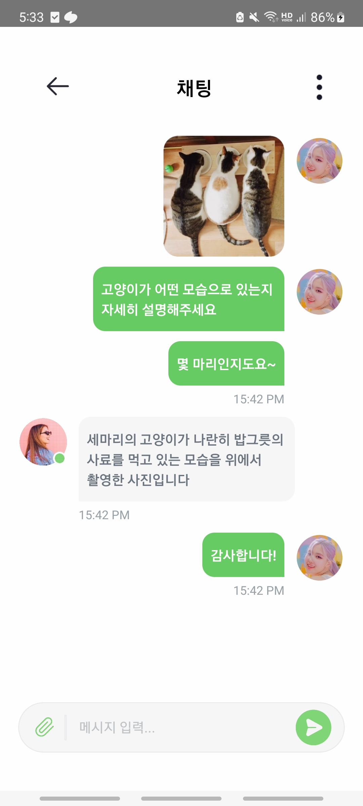
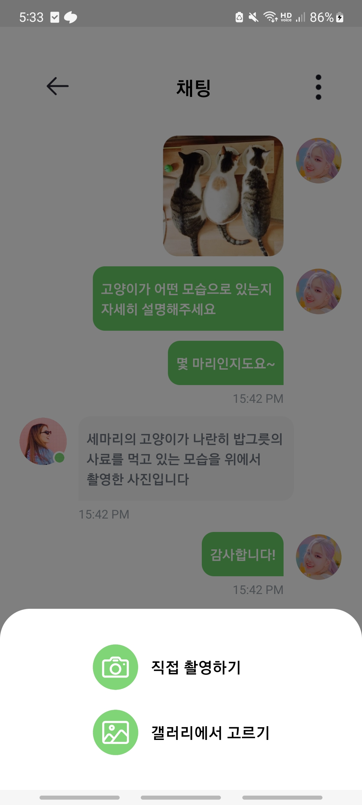
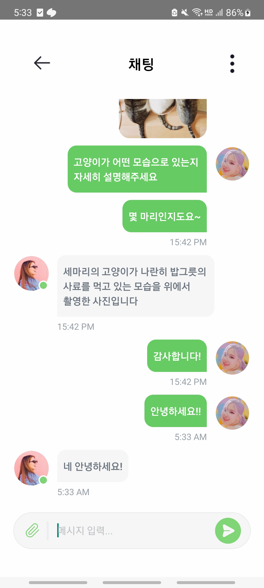
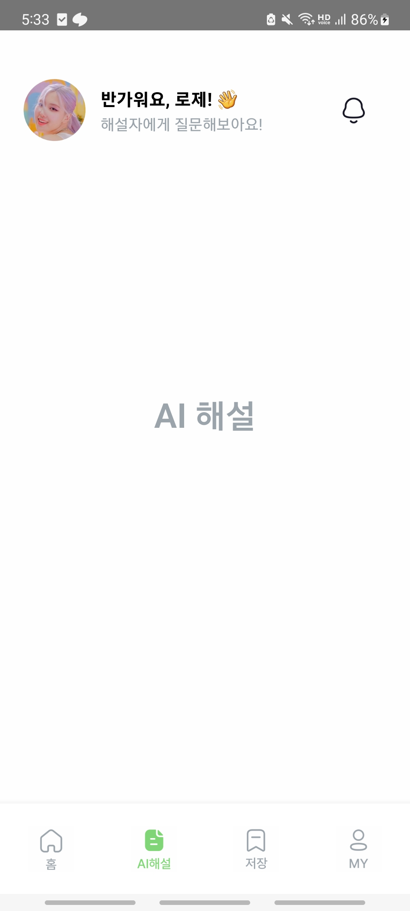
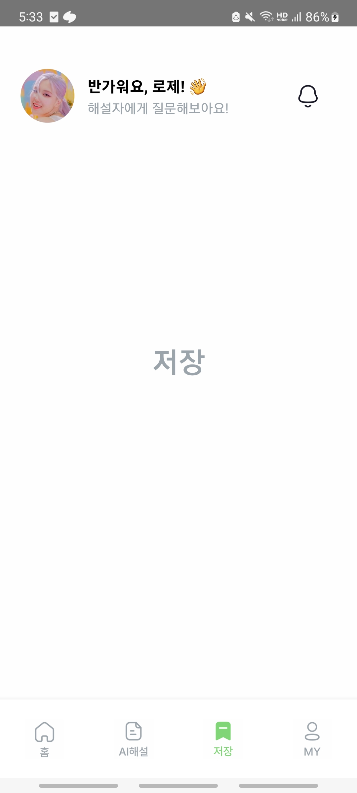
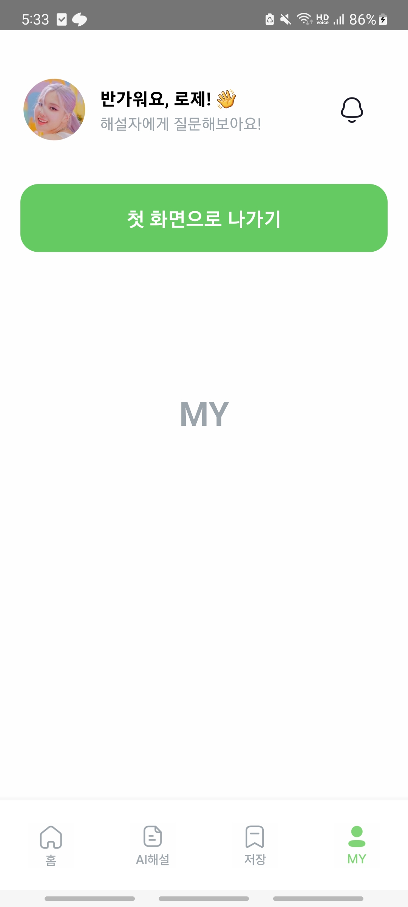

# [SigonganPA] Broady

---

## 0. 주의사항

- LG Gram으로 개발하여 안드로이드만 지원합니다.
- Figma에서 이미지 파일 다운로드나 세부 간격 등의 확인이 불가하였기 때문에, 디자인에 대한 정확한 구현은 어려울 수 있습니다. 필요한 이미지는 스크린샷 및 배경 지우기 등을 하여 구현하였고, 세부 간격은 대략적으로 구현하였으며, 색상은 Color Picker Extension을 사용하여 구현하였습니다.
- Tailwind CSS를 사용하였습니다.

## 1. 개발 일지

### 2024.01.12.

- 레포지토리 생성 (https://github.com/seank021/SigonganPA/)
- 프로젝트 기본 설정
- 온보딩 화면 구현
- 각 페이지 뷰 구현
- 재사용 Form 구현 (ButtonForm, WecomeHeader)
- 앱 이름, 앱 아이콘 설정

### 2024.01.13.

- 스타일 설정 및 수정
- 채팅 화면 구현
- 재사용 Form 구현 (PageHeader, ChatForm)
- 스플래시 화면 구현
- README.md 작성

## 2. 실행 커맨드

1. apk 파일로 실행

   - apk 파일을 모바일 기기에 설치하여 앱을 실행합니다.

2. git clone 후 실행

   - npm run android (npm install 후 실행)

## 3. 실행 화면 및 설명

### 0) 스플래시 화면

### 1) 온보딩 화면

- "사진 해설을 받고 싶어요" 버튼을 누르면 닉네임 입력 화면으로 이동합니다.
- "해설자로 활동할게요"는 아무런 기능이 없습니다.

### 2) 닉네임 입력 화면

- 여기서 입력한 닉네임으로 앱 내에서 불리게 됩니다.
- 예를 들어, "로제"를 입력하면 다음 페이지에서 "반가워요, 로제!"라는 문구가 뜹니다.
- 닉네임 입력 후 "브로디 시작하기" 버튼을 누르면 홈 화면으로 이동합니다.
- 뒤로 가기 버튼을 누르면 온보딩 화면으로 이동합니다.

### 3) 홈 화면

- "채팅 입장" 버튼을 누르면 채팅 화면으로 이동합니다.

### 4.1.) 채팅 화면 1

- 가장 기본적인 채팅 화면입니다.
- 주어진 더미 데이터를 사용하여 구현하였습니다.
- 뒤로 가기 버튼을 누르면 홈 화면으로 이동합니다.

### 4.2.) 채팅 화면 2

- bottom sheet가 올라와 있는 모습입니다.
- 기능은 구현하지 않았습니다.

### 4.3.) 채팅 화면 3

- 메시지 전송 기능을 구현하여 메시지를 추가적으로 보낸 이후의 모습입니다.
- 메시지를 그냥 보내면 나의 메시지로, 메시지 앞에 '/'를 붙여서 보내면 상대방의 메시지로 표시됩니다.
- 현재 시각을 반영하도록 하였습니다.

### 5) AI 해설 화면

### 6) 저장 화면

### 7) MY 화면

- "첫 화면으로 나가기" 버튼을 누르면 온보딩 화면으로 이동합니다.

